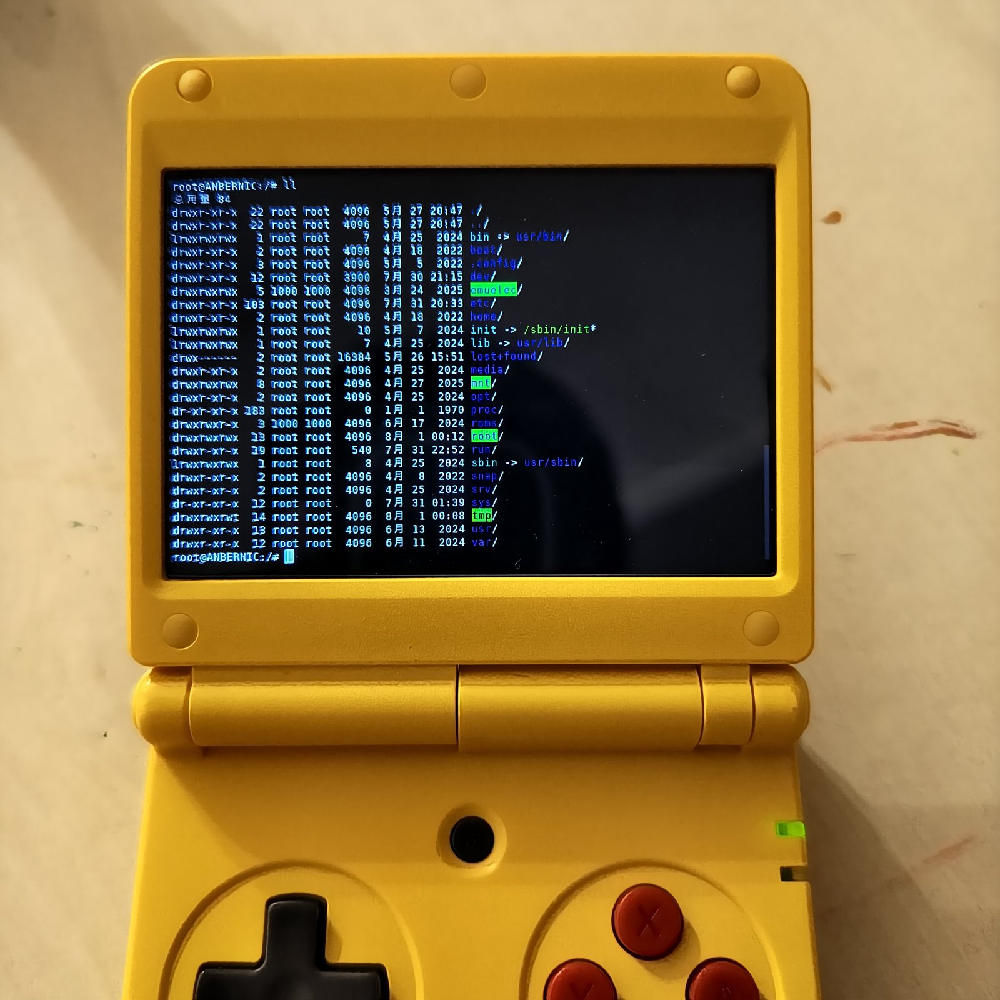
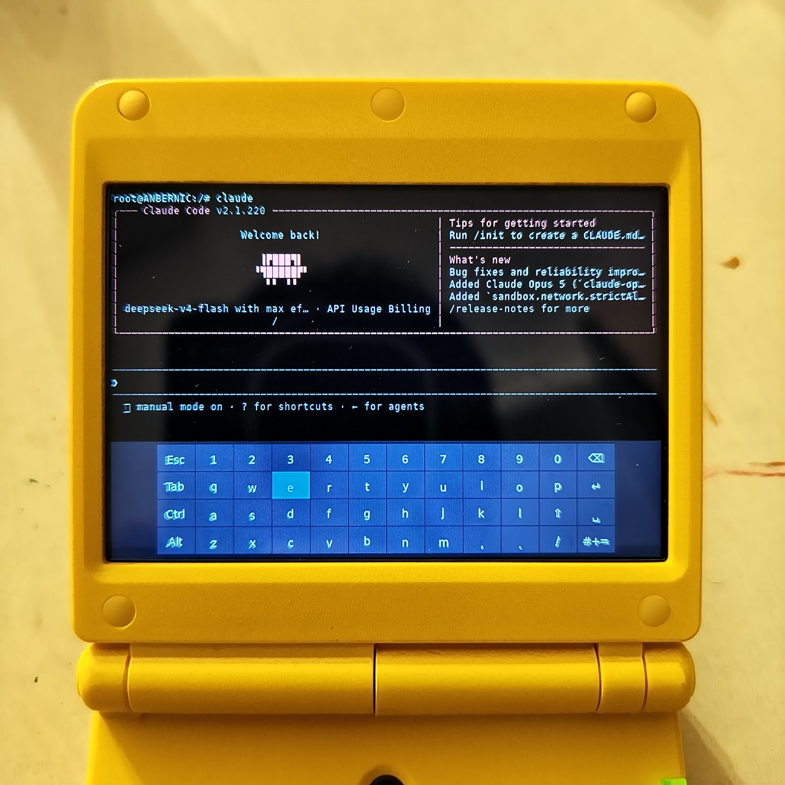
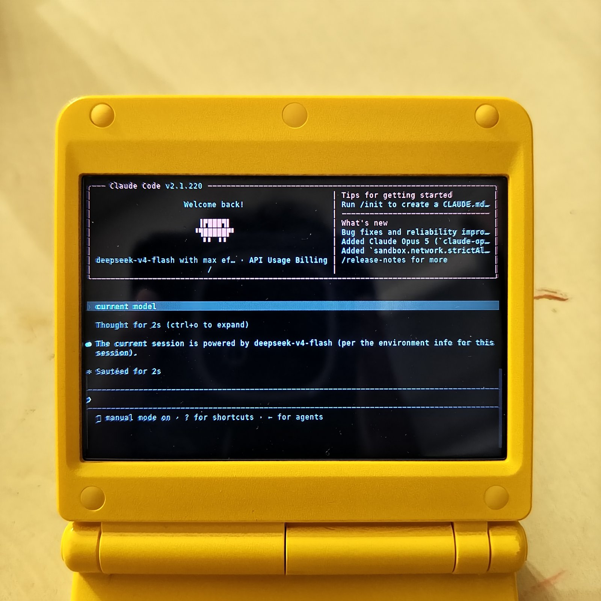
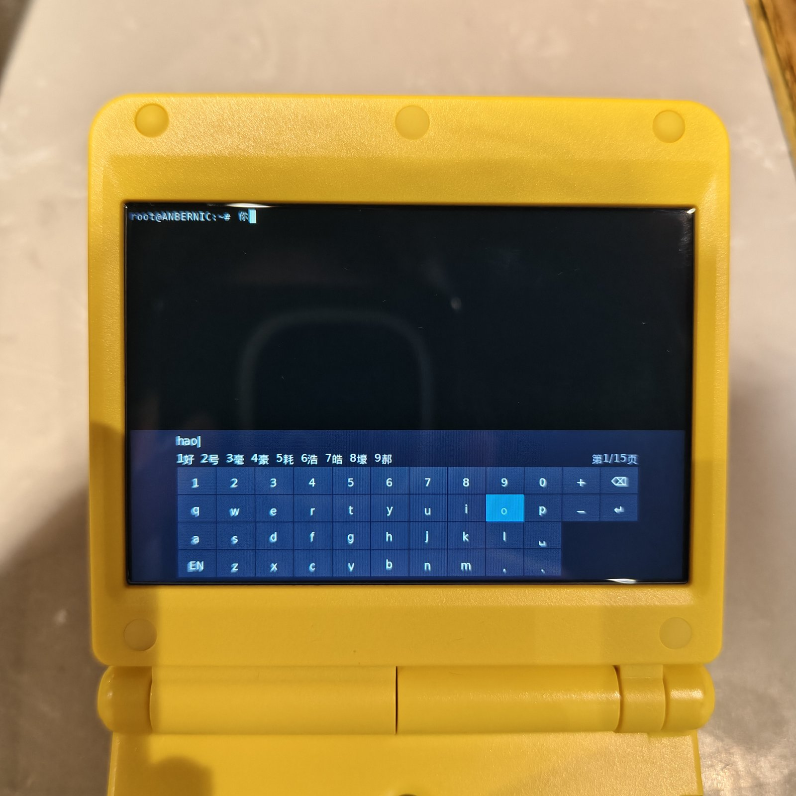
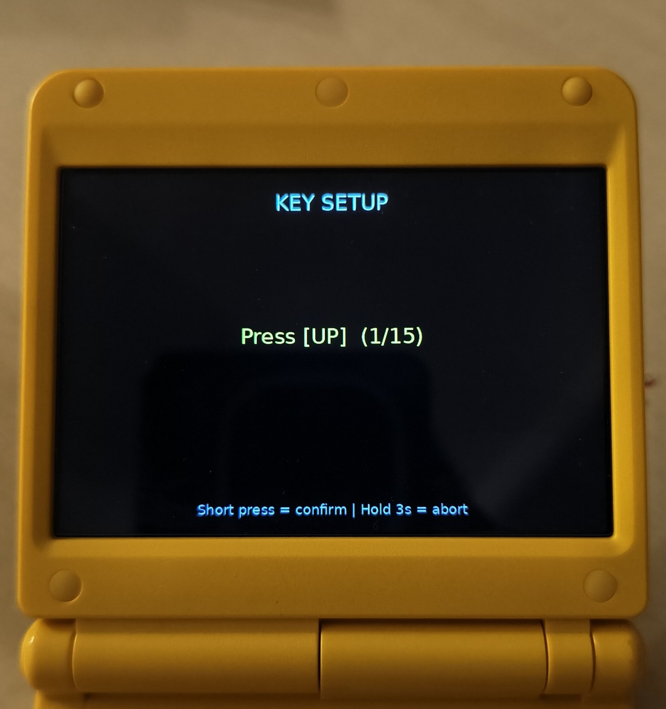

# SimpleTerminalPy

[English](README.md) | [简体中文](README_zh.md)

用 **Python + PySDL2 + PIL** 重写的嵌入式掌机终端模拟器，基于 [SimpleTerminal](https://github.com/haoict/SimpleTerminal)（C/SDL2 版）移植。

- 完整 VT100 转义序列解析（30+ CSI 命令）
- 256 色 + SGR 属性（粗体/下划线/反显/闪烁）
- 24 位真彩色（38;2/48;2 精确 RGB）
- 括号粘贴（DEC 2004）——vim/bash/tmux 中多行粘贴安全
- PTY 交互式 shell（vim / top / htop 等均可运行）
- 屏幕虚拟键盘（OSK）
- Scrollback 历史缓冲（256 行）
- 中文双列宽显示（自带 CJK 字体，Apache 2.0）
- 按键校准向导（自适应任何掌机）

## 截图






---

## 运行

```bash
# 启动脚本（APPS 目录）
./SimpleTerminalPy.sh

# 直接运行
python3 main.py

# 强制重新校准按键
python3 main.py -reset-keymap

**最低分辨率**：640×480（横屏）——受 OSK 宽度（608px）与按键说明页约束

# 命令行参数
python3 main.py [-font font.ttf] [-fontsize 12] [-rotate 0|90|180|270]
                [-term xterm-256color] [-reset-keymap] [-r "command"]
```

---

## 按键校准（首次启动）

首次启动（或 `-reset-keymap`）会进入**按键校准向导**：



```
        KEY SETUP

    Press [UP]  (1/15)
    ...
    Short press = confirm | Hold 3s = abort
```

| 操作 | 行为 |
|------|------|
| **短按**（按下并松开） | 确认当前键 → 记录 → 进入下一个 |
| **长按 3 秒** | 放弃校准，退出程序，不保存任何数据 |
| **按到已分配的键** | 不推进，等待按不同的键 |

校准顺序：`UP → DOWN → LEFT → RIGHT → A → B → X → Y → MENU → SELECT → START → L1 → R1 → L2 → R2`

校准结果保存为 `key_map.json`（与程序同目录）：

```json
{
  "keys": {
    "up":    {"type": "hat", "value": 1, "device": 0},
    "x":     {"type": "key", "value": 307, "device": 1},
    ...
  }
}
```

- `type`: `btn`（手柄按钮）/ `hat`（D-Pad）/ `key`（键盘通道）/ `cbtn`（GameController）
- `device`: 来源设备 ID。手柄通道（`btn`/`hat`/`cbtn`）记录真实摇杆设备 ID；`key` 通道使用固定 `KBD_DEVICE` 常量——SDL2 键盘事件不携带设备 ID，key 通道按键无法按设备与外接键盘区分

---

## 按键功能

> 所有按键在首次启动时由玩家校准定义，以下为逻辑键功能。

### 全局（任何模式下生效）

| 按键 | 功能 |
|------|------|
| **MENU** | 退出程序 |
| **X** | 显示 / 隐藏 OSK |
| **Y** | 切换 OSK 位置（底部 / 顶部） |
| **L1 + R1** | 删除 key_map.json（下次启动重新校准） |

### OSK 显示时（虚拟键盘可见）

| 按键 | 功能 |
|------|------|
| **D-Pad (UP/DOWN/LEFT/RIGHT)** | 移动 OSK 光标（长按加速） |
| **A** | 按下 OSK 当前选中的键 |
| **B** | Backspace |
| **L1** | 按住式 Shift（按住=大写，松开=小写） |
| **R1** | Sticky 修饰键（选中 Ctrl/Alt/⇧ 键后按 R1 锁定/解锁） |
| **L2** | 左方向键（直通终端，vim 中可用） |
| **R2** | 右方向键（直通终端，vim 中可用） |
| **START** | Enter |
| **SELECT** | Tab |

### OSK 隐藏时（直通模式，运行 vim/htop/top 等）

| 按键 | 功能 |
|------|------|
| **D-Pad (UP/DOWN/LEFT/RIGHT)** | 方向键 |
| **A** | Enter |
| **B** | Ctrl+C |
| **SELECT** | Tab |
| **L2** | Scrollback 上翻 3 行 |
| **R2** | Scrollback 下翻 3 行 |

### 物理键盘（外接 USB / 蓝牙键盘）

| 按键 | 功能 |
|------|------|
| 字母 / 数字 / 符号 | 正常输入（IME 组合文本经 SDL_TEXTINPUT） |
| 方向键 / Home / End / PageUp / PageDown / F1-F12 | 标准转义序列 |
| Ctrl + 字母/符号 | 控制字符（Ctrl+C / Ctrl+D / Ctrl+\ = 0x1C / Ctrl+Space 等） |
| Tab / Shift+Tab | Tab / 反向 Tab |
| Enter / Alt+Enter | 回车 / ESC+回车 |
| Ctrl+Shift+V | 剪贴板粘贴 |

> 掌机按键与蓝牙键盘按事件类型隔离：`btn`/`hat`/`cbtn` 来自手柄设备，与键盘事件天然不冲突。`key` 通道与任何外接键盘共享 SDL 键盘事件（SDL2 无逐键盘设备 ID）——仅当掌机按键被校准为 key 通道时才可能冲突。

---

## OSK 使用

- **A** 选中并输入高亮键
- **L1** 按住切换大写，松开恢复小写
- **R1** 锁定修饰键（sticky）：把光标移到 `Ctrl`/`Alt`/`⇧` 键上按 R1 锁定，再按字母即可输入组合键（如 Ctrl+A）；再按 R1 解锁
- **R1 锁定 Shift**：大写锁定（L1 不影响锁定的 Shift）
- 符号层通过 OSK 上的 `#+=` 键进入，`ABC` 键返回
- **X** 随时显示/隐藏 OSK

---

## Scrollback

- **L2 / R2**：上下翻 3 行（OSK 隐藏时）
- 屏幕右上角显示 `[N]^` 滚动指示器
- 按任何其他键自动回到屏幕底部

---

## 字体

项目自带字体，不依赖设备固件字体：

```
fonts/
├── DroidSansMono.ttf          # 英文等宽主字体
├── DroidSansFallbackFull.ttf  # 中文 CJK 字体
└── LICENSE.txt                # Apache License 2.0
```

两款字体均来自 Google Android 开源项目，**Apache 2.0 许可证**，可自由再分发。若自带字体缺失，渲染器会回退到系统字体（DejaVu Sans Mono、掌机固件字体等）。

---

## 文件结构

```
SimpleTerminalPy/
├── main.py              # 主循环 + 事件分发 + 启动流程
├── config.py            # 调色板（259 色）+ 默认配置
├── terminal.py          # Glyph / Term / Cursor 数据模型
├── vt100.py             # VT100 状态机（30+ CSI 命令）
├── pty_handler.py       # PTY 创建 + select 读取线程
├── renderer.py          # PIL 脏行增量渲染 + 字形 LRU 缓存
├── osk.py               # 屏幕虚拟键盘
├── input_handler.py     # 事件 (type, value, device) → 逻辑键
├── key_calibrate.py     # 按键校准向导 + 按键说明界面
├── wcwidth.py           # Unicode East Asian Width
├── fonts/               # 自带字体（Apache 2.0）
│   ├── DejaVuSansMono.ttf        # 英文等宽主字体（符号覆盖全）
│   ├── DroidSansMono.ttf         # 英文等宽回退
│   ├── DroidSansFallbackFull.ttf # 中文 CJK
│   └── LICENSE.txt
├── screenshots/         # README 截图
├── tests/               # unittest 测试套件（64 个）
│   └── test_simple_terminal_py.py
├── key_map.json         # 玩家校准结果（运行时生成）
├── SimpleTerminalPy-Raw.sh  # 源码版启动脚本（部署时改名 SimpleTerminalPy.sh）
├── SimpleTerminalPy-Bin.sh  # 二进制版启动脚本（打进 release 包）
├── build_release.sh     # PyInstaller onedir 打包脚本
├── sync_raw_to_app.sh   # 同步源码到 SD 卡
└── sync_bin_to_app.sh   # 同步二进制包到 SD 卡
```

---

## 同步到掌机

```bash
# 同步源码到 /mnt/sdcard/Roms/APPS/SimpleTerminalPy
# 自动清理 __pycache__ 和 key_map.json（下次启动重新校准）
bash sync_raw_to_app.sh

# 同步打包的二进制版（需先运行 build_release.sh）
bash sync_bin_to_app.sh
```

---

## 已知限制

- 彩色 Emoji 不支持（嵌入式终端合理取舍）
- 极端全屏刷新（如 vim 首次启动）可能有短暂掉帧
- 粗体/斜体 SGR 属性渲染无字形变化（粗体颜色已实现亮化，与 C 版一致）

## 许可

MIT License — 基于 [SimpleTerminal](https://github.com/haoict/SimpleTerminal)（MIT）
